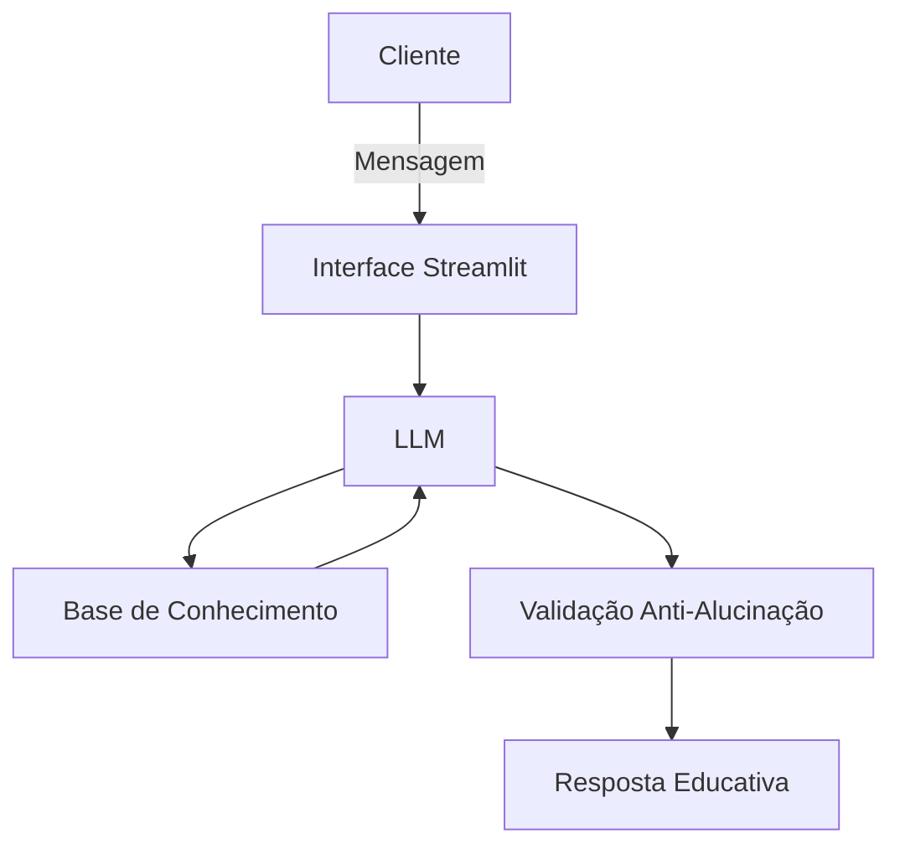

# 🤖 Tom — Agente Educativo de Finanças Pessoais

> Agente de IA generativa voltado para educação financeira de adolescentes e jovens iniciantes.

---

## 💡 O Problema

Muitos jovens não sabem para onde o dinheiro vai, têm dificuldade em criar reservas e nunca aprenderam conceitos básicos de finanças pessoais — como juros, metas e poupança.

## ✅ A Solução

O **Tom** é um agente conversacional educativo que:

- Explica conceitos financeiros com linguagem simples e acessível
- Analisa gastos e receitas com base no perfil do cliente
- Orienta sobre metas, reserva de emergência e produtos de baixo risco
- **Nunca inventa informações** — admite quando não sabe e só responde com base nos dados fornecidos
- Não substitui consultores financeiros — educa, não recomenda

---

## 👤 Persona

| Atributo | Detalhe |
|---|---|
| Nome | Tom |
| Personalidade | Amigável, didático, direto, sem julgamentos |
| Tom de voz | Informal, encorajador, acessível |
| Público-alvo | Adolescentes e jovens iniciantes em finanças |

---

## 🗂️ Estrutura do Projeto

```
📁 lab-agente-financeiro/
├── 📁 data/
│   ├── transacoes.csv
│   ├── historico_atendimento.csv
│   ├── perfil_investidor.json
│   └── produtos_financeiros.json
├── 📁 docs/
│   ├── 01-documentacao-agente.md
│   ├── 02-base-conhecimento.md
│   ├── 03-prompts.md
│   ├── 04-metricas.md
│   └── 05-pitch.md
├── 📁 src/
│   └── app.py
└── README.md
```

---

## 🧠 Arquitetura



---

## 📁 Base de Conhecimento

| Arquivo | Conteúdo |
|---|---|
| `transacoes.csv` | Histórico de gastos e receitas do cliente fictício |
| `historico_atendimento.csv` | Interações anteriores com o agente |
| `perfil_investidor.json` | Perfil, metas e preferências do cliente |
| `produtos_financeiros.json` | Produtos educativos de baixo risco disponíveis |

> Os dados foram adaptados para o **Luiz Augusto**, 17 anos, estudante, perfil iniciante — garantindo coerência com o foco educativo do Tom.

---

## 🛡️ Segurança e Anti-Alucinação

- Responde **apenas com base nos dados fornecidos**
- Admite limitações em vez de inventar respostas
- Recusa solicitações de dados sensíveis (CPF, saldo, senha)
- Resiste a tentativas de **prompt injection**
- Não faz recomendações de investimento de alto risco

---

## 📊 Métricas de Avaliação

| Métrica | Meta |
|---|---|
| Assertividade | ≥ 4/5 |
| Segurança | 5/5 |
| Coerência contextual | ≥ 4/5 |
| Progressividade | ≥ 4/5 |
| Aderência ao escopo | 5/5 |

> Avaliado com 3 usuários reais (11, 42 e 53 anos) e 10 cenários de teste estruturados.

---

## 🛠️ Tecnologias

- Python + Streamlit
- LLM via API (compatível com OpenAI, Ollama e similares)
- Dados em CSV e JSON
- Engenharia de prompt com Few-Shot Prompting

---

## ▶️ Como Rodar

```bash
pip install -r src/requirements.txt
streamlit run src/app.py
```

---

## 📄 Documentação

| Doc | Descrição |
|---|---|
| [01 — Documentação do Agente](docs/01-documentacao-agente.md) | Caso de uso, persona e arquitetura |
| [02 — Base de Conhecimento](docs/02-base-conhecimento.md) | Dados e estratégia de integração |
| [03 — Prompts](docs/03-prompts.md) | System prompt, exemplos e edge cases |
| [04 — Métricas](docs/04-metricas.md) | Avaliação e resultados dos testes |
| [05 — Pitch](docs/05-pitch.md) | Roteiro do pitch de 3 minutos |

---

> Desenvolvido como parte do desafio **Agente Financeiro Inteligente com IA Generativa** — Bradesco - GenAI & Dados | Dio.me
